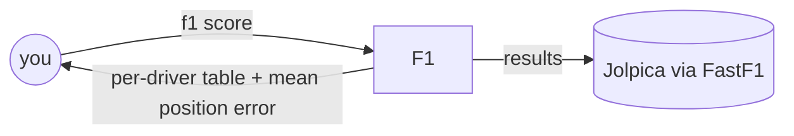
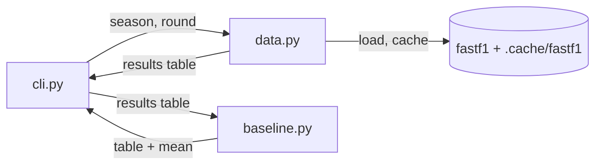

# F1 · architecture

**Status:** Active · **Updated:** 2026-09-25 by /ship walking-skeleton

## Context

## Components

| Component   | Folder    | Does |
| ----------- | --------- | ---- |
| cli.py      | `src/f1/` | Parses flags, prints the table, turns data errors into one line and exit 1 |
| data.py     | `src/f1/` | The only FastF1 caller: loads one race, raises NoSuchRound / NoResultsYet / FetchFailed |
| baseline.py | `src/f1/` | Scores the grid guess: drops withdrawals, pit-lane as last slot, mean position error |
