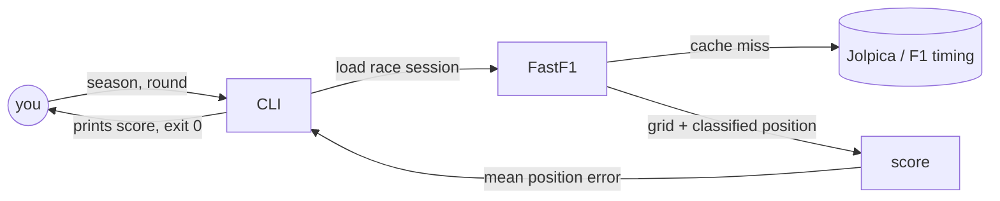
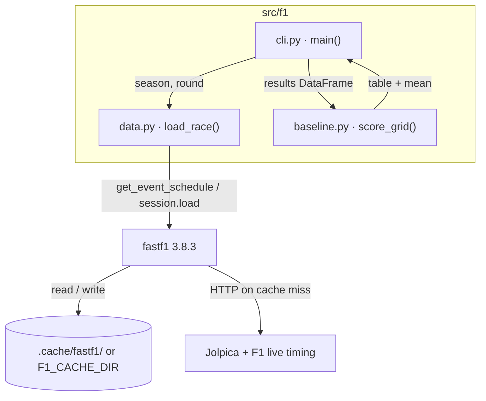
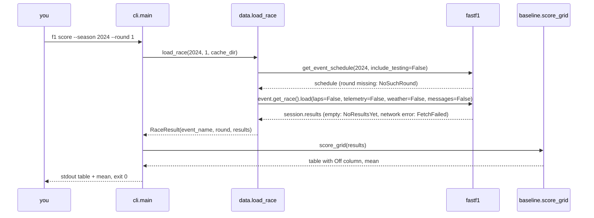

# Walking skeleton

**Version:** v1 · **Status:** Refined · **Type:** Skeleton · **Project type:** Data app (CLI)

**Shape doc:** docs/specs/f1-predictions/shape.md
**Depends on:** None
**Page:** https://claude.ai/artifact/7c9ssmGM6CuK39ab7j6951

One command scores the naive guess "race finishes in grid order" for one past
race and prints the mean position error. It exists to prove the stack, the data
source, the test and CI before any ML gets written.

## Problem

The repo is empty. Nothing can predict or score yet, and the data source, the
stack and the test rails are all unproven. Every later slice needs them.

## Stack

Decided at pause 1 on 2026-09-25. This is the record for the whole project.

| Decision | Choice | Why |
| -------- | ------ | --- |
| Language and libraries | Python, pandas, scikit-learn | Standard ML learning stack; FastF1 is Python and returns pandas |
| Package manager | uv (`pyproject.toml` plus `uv.lock`) | One tool for Python version, venv, deps and lockfile |
| Data source | FastF1 3.8.3 (latest at 2026-09-25) | Results via Jolpica, plus lap timing from 2018 for slice 3. Caches every request |
| Storage | FastF1's on-disk cache only | No database needed to score a race |
| Interface | CLI command. Jupyter installed for exploring and learning | CLI is testable end to end; notebooks import the same code |
| Tests and lint | pytest, ruff | Python defaults |
| Repo and CI | GitHub, GitHub Actions | Personal project |
| Runs on | Your laptop. "Deployed" means the command runs from a fresh clone and CI is green | Personal use only |

Source facts: FastF1 backends and caching, [docs.fastf1.dev](https://docs.fastf1.dev/fastf1.html).
Jolpica unauthenticated limit is 4 requests/second and 500/hour,
[jolpica-f1 rate limits](https://github.com/jolpica/jolpica-f1/blob/main/docs/rate_limits.md).

## Slice test

| Check | Result |
| ----- | ------ |
| Cuts every layer it needs | yes. Fetch (FastF1), scoring, CLI output, pytest, CI |
| One e2e test walks it | yes. Run the CLI against a saved race fixture and check the printed score |
| Worth shipping alone | yes, as slice 0. You can see how good the grid guess was for any past race, and every later slice lands on working rails |
| Fits (≤5 scenarios, ≤2 areas) | yes. 5 scenarios; data loading plus scoring and CLI |

**Path:** full. It adds the whole stack, a data dependency and CI.

## User story

As someone learning ML on F1 data, I want to score the "grid order" guess for
a past race, so that I know the number every model has to beat.

## Flow



You pass a season and round. The CLI loads that race through FastF1, which
serves it from cache or fetches it. It scores grid position against finishing
position and prints the mean position error.

## Acceptance criteria

```gherkin
Scenario: Score the grid guess for a finished race
  Given the 2024 Bahrain Grand Prix (season 2024, round 1) has results
  When you score the grid baseline for season 2024, round 1
  Then it prints "2024 Bahrain Grand Prix (round 1)", "Drivers scored: 20" and "Mean position error: 2.30 places"
  And every driver in the official classification is scored
  And it exits with code 0

Scenario: Retirements count at their classified position
  Given the 2024 Australian Grand Prix (season 2024, round 3), where Max Verstappen started 1st and retired
  When you score the grid baseline for season 2024, round 3
  Then 19 drivers are scored and the mean position error is 3.89
  And Verstappen is scored at position 19, 18 places off
  And a driver with grid position 0 (pit-lane start, e.g. Ocon at 2024 round 20) counts as starting from the last grid slot
  And a driver whose status is "Withdrew" (listed but never started) is left out

Scenario: Race has not happened yet
  Given a 2026 race that has not been run as of the day you run it
  When you score the grid baseline for that round
  Then it prints "No results yet for 2026 round {N}"
  And it exits with a non-zero code

Scenario: Round does not exist
  Given the 2024 season had 24 rounds
  When you score the grid baseline for season 2024, round 25
  Then it prints "2024 has no round 25 (rounds 1 to 24)"
  And it exits with a non-zero code

Scenario: No network and nothing cached
  Given the race is not in the local cache and the network is unreachable
  When you score the grid baseline for that race
  Then it prints one line saying the data could not be fetched and that it needs network the first time
  And it prints no stack trace
  And it exits with a non-zero code
```

Mean position error = the average of |finishing position − grid position|
over all scored drivers. Lower is better. 0 means everyone finished where they
started.

## Scope

**In:**
- One CLI command that scores the grid baseline for one season and round
- Main Grand Prix only. On sprint weekends the sprint is ignored
- FastF1 cache kept in a folder inside the repo, ignored by git
- pytest suite, plus one e2e test that runs the CLI against a saved fixture, with no network
- ruff lint
- GitHub Actions running lint and tests on push
- Jupyter as a dev dependency, so `uv run jupyter lab` opens against the same environment
- README with setup and the one command

**Out:**
- Scoring across many races and seasons, the quali baseline, more metrics. Slice 1 picks these up
- Any notebook content. Slice 1 is the first with something worth exploring
- Any trained model. Slices 2 and 3
- Live and upcoming race predictions. Slice 5

## Interface

One command, `f1`, with one subcommand, `score`. Later slices add their own
subcommands next to it (`f1 backtest`, `f1 predict`).

```
$ uv run f1 score --help
usage: f1 score --season YEAR --round N

Score the "finishing order = starting grid" guess for one Grand Prix.

options:
  --season YEAR   championship year, e.g. 2024
  --round N       round number within that season, e.g. 1
  -h, --help      show this help and exit
```

Both flags are required. Sprint races are never scored.

**Output on success** goes to stdout, exit 0. Layout below. Every value is a
placeholder (`n`, `ABC`), not real data:

```
2024 Bahrain Grand Prix (round 1)
Guess: finishing order = starting grid

Driver  Grid  Finish  Off  Status
ABC        n       n    n  Finished
ABC        n       n    n  Lapped
ABC        n       n    n  Retired
...

Drivers scored: n
Mean position error: n.nn places
```

- One row per driver in the official classification who started, sorted by finishing position. Drivers with Status `Withdrew` are left out.
- `Driver` is the three-letter code (VER, HAM). `Status` is the text F1 gives for that driver.
- `Off` = |Finish − Grid|. Pit-lane starters show `Grid` as `PL`, scored as the last grid slot.
- The mean has two decimals.

**Errors** go to stderr as one line, never a stack trace:

| Case | Message | Exit |
| ---- | ------- | ---- |
| Race not run yet | `No results yet for <season> round <round>` | 1 |
| Round out of range | `2024 has no round 25 (rounds 1 to 24)` | 1 |
| Can't fetch, nothing cached | `Could not fetch 2024 round 1: no network and nothing cached. The first run for a race needs internet.` | 1 |
| Missing or non-numeric flag | argparse's usage line plus the error | 2 |

**Cache:** race data is cached in `.cache/fastf1/` at the repo root, ignored by
git. A second run of the same race works offline.

**Preview:** this section. It's a CLI with no screens to render.

## Technical plan

### Approach

Three small modules in a `src/f1/` package. `data.py` is the only code that
talks to FastF1. `baseline.py` is a pure function: a results table goes in,
the per-driver table and the mean come out. `cli.py` parses flags, calls the
other two, prints, and picks the exit code. The e2e test runs the real `f1`
command against a FastF1 cache committed under `tests/fixtures/`, so CI never
touches the network.



`cli.py` never imports fastf1. Only `data.py` does, so slice 1 can reuse
`load_race` and `score_grid` from a notebook without the CLI.



The run asks for the season's schedule, finds the round, loads only the race
results, scores them and prints. Each failure point raises one named error,
and `cli.main` turns it into a one-line message on stderr and exit 1.

### Changes

Greenfield. Every file is new.

| File | What changes | Why |
| ---- | ------------ | --- |
| `pyproject.toml` | Project `f1`, `requires-python = ">=3.12"`, deps `fastf1>=3.8.3,<4` and `pandas`. Dev group: `pytest`, `ruff`, `jupyterlab`. Script `f1 = "f1.cli:main"`. Build backend `uv_build` | Stack decisions. The script entry is what makes `uv run f1` work |
| `.python-version` | `3.12` | uv picks the interpreter from it. FastF1 needs 3.10 or later (PyPI metadata) |
| `uv.lock` | Generated by `uv lock` | Reproducible installs. CI runs `uv sync --locked` |
| `src/f1/__init__.py` | Empty | Package marker |
| `src/f1/data.py` | `RaceResult` dataclass. `load_race(season, round_, cache_dir, now=None)`. Errors `DataError` plus subclasses `NoSuchRound`, `NoResultsYet`, `FetchFailed`, each carrying the exact user message from the Interface table. Creates the cache dir, then `fastf1.Cache.enable_cache` (it raises `NotADirectoryError` otherwise). Sets `fastf1.set_log_level("ERROR")` and suppresses FastF1's `UserWarning`s. Maps errors by call site: `ValueError` from `get_event_schedule` means `FetchFailed`, `ValueError` from `get_event_by_round` means `NoSuchRound`. Empty results mean `NoResultsYet` if the race start (`Session5DateUtc`) is after `now`, else `FetchFailed` | Scenarios 1, 3, 4, 5. Rules from the POC, see O12 to O14 |
| `src/f1/baseline.py` | `score_grid(results) -> (DataFrame, float)`. Drops drivers with Status `Withdrew` (they never started). Grid 0 becomes the number of drivers scored and is flagged as `PL`. `Off = abs(Position - Grid)`. Sorted by Position | Scenarios 1, 2 |
| `src/f1/cli.py` | argparse with a `score` subparser. Formats the table. Catches `DataError` only, prints `str(err)` to stderr, returns 1. Cache dir from the `F1_CACHE_DIR` env var, else `.cache/fastf1` | Interface section |
| `tests/test_baseline.py` | Unit tests on hand-built DataFrames: a pit-lane starter, a retirement, a hand-computed mean | Scenario 2 edge cases, independent of any real race |
| `tests/test_cli_e2e.py` | Runs the installed `f1` command as a subprocess with `F1_CACHE_DIR` pointed at a temp copy of the fixture and `HTTPS_PROXY`/`HTTP_PROXY` set to `http://127.0.0.1:9`, so any cache miss fails instead of reaching the internet | Scenarios 1, 2, 4, 5 |
| `tests/test_data.py` | Calls `load_race` in-process on the fixture with `now` fixed at 2026-09-25 | Scenario 3. A subprocess test would break once the fixture's unrun race date passes |
| `tests/fixtures/fastf1_cache/` | FastF1 cache captured once: the 2024 schedule, 2024 rounds 1 and 3, the 2026 schedule and 2026 round 15 (unrun on 2026-09-25). Expected well under 1 MB | Lets every test run offline |
| `tests/fixtures/capture.py` | One-off script that rebuilds the fixture cache from the network. Not run in CI | So the fixture can be regenerated, not hand-edited |
| `.github/workflows/ci.yml` | On push and PR: `astral-sh/setup-uv`, `uv sync --locked`, `uv run ruff check .`, `uv run ruff format --check .`, `uv run pytest` | "CI runs it" rail |
| `.gitignore` | Add `.cache/`, `.venv/`, `__pycache__/`, `.ipynb_checkpoints/` | Local cache and envs stay out of git |
| `README.md` | Setup (`uv sync`), the one command, running tests, `uv run jupyter lab` | Fresh-clone proof |

Reusing: nothing yet (empty repo). From FastF1: its cache, `get_event_schedule`,
`EventSchedule.get_event_by_round` (raises `ValueError` on an unknown round,
per [docs.fastf1.dev/events](https://docs.fastf1.dev/events.html)), and
`SessionResults` columns `Abbreviation`, `GridPosition`, `Position`, `Status`
([docs.fastf1.dev/core](https://docs.fastf1.dev/core.html)).

### Earn-it

| Added | Triggered by |
| ----- | ------------ |
| `F1_CACHE_DIR` env var | The e2e test has to point the real command at the fixture cache. Nothing else reads it |
| Named `DataError` subclasses | Scenarios 3, 4, 5 each need a different message. `cli.py` needs one thing to catch |
| `jupyterlab` dev dependency | You asked for Jupyter for exploring |
| Committed fixture cache | CI must pass without network (Jolpica is volunteer-run and rate-limited) |
| `now` parameter on `load_race` | Scenario 3 depends on today's date. A fixed `now` keeps the test stable |

Cut: scikit-learn. Nothing in this slice trains a model, so it arrives with slice 2.
Also cut: typer or click. argparse covers one subcommand with two flags.

### Non-functionals

| | |
| --- | --- |
| **Load** | One person, one race per run. A few HTTP requests on first fetch, zero after that |
| **Breaks first** | At 10× (a full season per run, which is slice 1) the unauthenticated Jolpica limit of 500 requests/hour is the ceiling. The cache means each race is fetched once. Slice 1 measures it |
| **Security surface** | Local only, no one else can call it. Trusts FastF1's parsed responses. No secrets. Stores public race data in `.cache/fastf1/` |
| **Proof it works** | CI green on `main`, and `uv run f1 score --season 2024 --round 1` printing `Mean position error:` from a fresh clone |
| **Rollout** | No flag, nothing deployed. Rollback is `git revert`. Creating the GitHub repo and first push happen at `/ship`, with your OK |

### Test plan

| Scenario | Test | Command |
| -------- | ---- | ------- |
| 1. Finished race | `tests/test_cli_e2e.py::test_scores_bahrain_2024` | `uv run pytest tests/test_cli_e2e.py -k bahrain` |
| 2. Retirements and pit-lane | `tests/test_cli_e2e.py::test_retirement_is_scored` plus `tests/test_baseline.py` | `uv run pytest -k "retirement or baseline"` |
| 3. Not run yet | `tests/test_data.py::test_unrun_race` | `uv run pytest -k unrun` |
| Network down, schedule cached, race not | `tests/test_data.py::test_past_race_empty_results_is_fetch_failure` | `uv run pytest -k fetch_failure` |
| 4. No such round | `tests/test_cli_e2e.py::test_round_out_of_range` | `uv run pytest -k out_of_range` |
| 5. Offline, nothing cached | `tests/test_cli_e2e.py::test_offline_empty_cache` | `uv run pytest -k offline` |
| Withdrew left out | `tests/test_baseline.py::test_withdrew_is_dropped` (hand-built frame) | `uv run pytest -k withdrew` |
| Lint | ruff | `uv run ruff check . && uv run ruff format --check .` |

**E2E:** `test_scores_bahrain_2024` runs `f1 score --season 2024 --round 1` as
a subprocess against the fixture cache. It asserts exit 0, the race name line,
and `Mean position error: 2.30 places`. That value was computed by hand from the POC data: 46 places off across 20 drivers.

### Chunks

Single chunk. About 12 small files, one area, too tightly linked to split.

### Risks

| Risk | Mitigation |
| ---- | ---------- |
| A network failure on the race load returns empty results, looking exactly like an unrun race (found by the POC) | Decide by race date: empty plus past date means `FetchFailed`. A test covers it |
| Right after a race, before results publish, you'd see "could not fetch" instead of "no results yet" | Accepted for slice 0. It lasts a few hours at most |
| FastF1 or Jolpica changes its data or goes down | Version pinned in `uv.lock`. CI runs on the fixture, so an outage never breaks tests |
| FastF1 prints INFO logs, breaking the one-line error rule | Set log level to ERROR in `data.py`. O14 confirms that silences it |

## Open items

| ID | What | Type | Raised at | Owner | Status | Answer |
| -- | ---- | ---- | --------- | ----- | ------ | ------ |
| O2 | Which data source | question | shape | spec 0 | Resolved | FastF1 3.8.3, results via Jolpica. Decided 2026-09-25 |
| O3 | Stack: language, libraries, CI host, where it runs | question | shape | spec 0 | Resolved | Python, pandas, scikit-learn, uv, pytest, ruff, GitHub Actions. CLI, plus Jupyter for exploring |
| O5 | Scoring metric | question | shape | spec 1 | Resolved | Skeleton uses mean position error. Slice 1 may add more |
| O6 | How DNFs, DSQs and pit-lane starts count | question | shape | spec 1 | Resolved | Official classification for everyone. Grid 0 counts as the last grid slot |
| O8 | Personal use, runs on your laptop | assumption | shape | user | Resolved | Confirmed: laptop plus CI, no hosting, no database |
| O10 | `session.load(laps=False, telemetry=False, weather=False, messages=False)` still fills `Abbreviation`, `GridPosition`, `Position`, `Status` for 2024 round 1 | unproven | spec p3 | poc | Resolved | Yes. 2024 R1: 20 rows, no nulls in the four columns. `ClassifiedPosition` is `R` for retirements; `Position` is always numeric. POC 2026-09-25 |
| O11 | What `GridPosition` holds for a pit-lane starter: 0, NaN, or something else. Plan handles 0 and NaN | unproven | spec p3 | poc | Resolved | `0.0`. Seen for MAG 2023 R13, STR 2023 R19, OCO 2024 R20. No NaN in 2023 or 2024. POC 2026-09-25 |
| O12 | What loading an unrun 2026 race does: empty results, or an exception, and which | unproven | spec p3 | poc | Resolved | Loads without error and returns an empty `SessionResults`. The same empty result comes back when the network is down and the race isn't cached, so the plan uses the race date to tell them apart. POC 2026-09-25 |
| O13 | A committed FastF1 cache replays with no network in CI, how offline mode is switched on, and how big it is for 2 races plus 2 schedules | unproven | spec p3 | poc | Resolved | Replays fine with `Cache.offline_mode(True)` and with a dead proxy. Two full seasons plus the 2026 schedule came to 768 KB, so the fixture is far smaller. Empty cache plus no network raises `ValueError("Failed to load any schedule data.")`. POC 2026-09-25 |
| O14 | FastF1's logging can be silenced so errors print as one line | unproven | spec p3 | poc | Resolved | `set_log_level("ERROR")` silences logging. FastF1 also emits a Python `UserWarning` (`Request returned: 504`) that logging doesn't cover, so it must be suppressed separately. POC 2026-09-25 |
| O15 | Scenario facts from memory: Verstappen started on pole and retired at 2024 round 3; 2024 had 24 rounds | assumption | spec p1 | poc | Resolved | 24 rounds: yes. Verstappen started 1st and retired: yes. Only 19 drivers were classified at R3, so his `Position` is 19. Scenario 2 updated. POC 2026-09-25 |
| O16 | A driver listed with status `Withdrew` never started (e.g. STR 2023 R15, grid 0, listed 20th). Score them, or leave them out? | question | poc | user | Resolved | Leave them out. Decided 2026-09-25 |
| O17 | FastF1 logged "Failed to load session info data!" for every race from this laptop. Results still load via Jolpica. Lap timing for slice 3 may be blocked on this network | flag | poc | user | Accepted risk | Doesn't affect slice 0. Recheck at slice 3 spec. Accepted 2026-09-25 |

_Never delete this section or its rows. See references/ledger.md._

_Still open in the shape doc, not needed for this slice: O1 (reading of "e2e"),
O4 (2026 regulation change), O7 (seasons to train on), O9 (ML level)._
